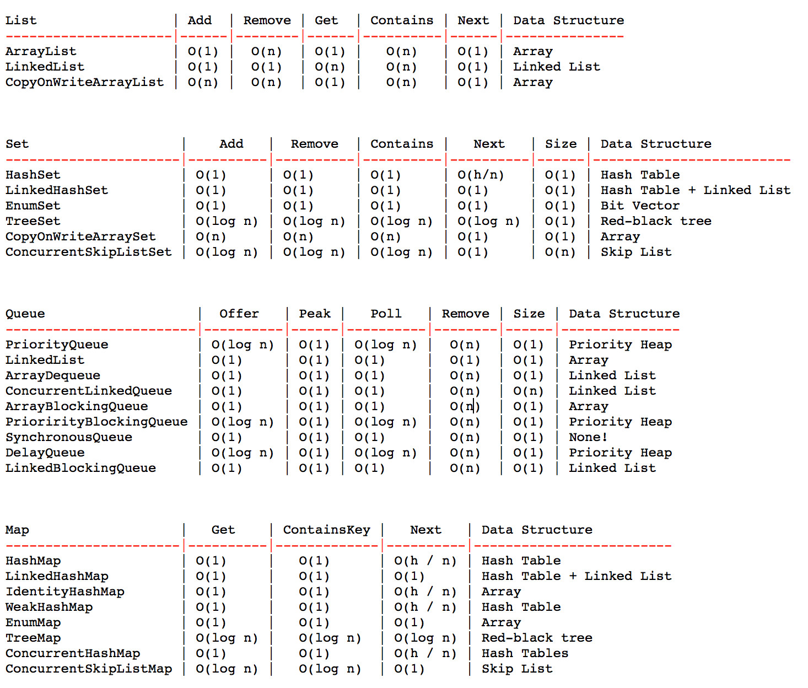
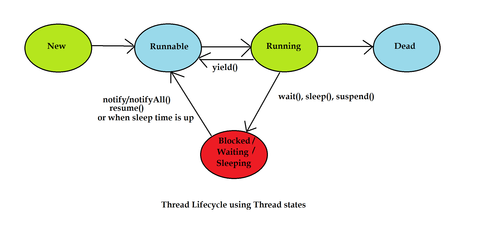
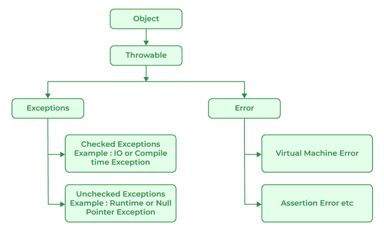

### JVM



javac -d bin .\src\main\java\org\example\Jvm.java
java -classpath .\bin\ org.example.Jvm 1 2

#### Just-in-time (JIT) компиляция

Компиляция — трансляция программы, составленной на исходном языке высокого уровня, в эквивалентную программу на
низкоуровневом языке, близком машинному коду.

Интерпретация — пооператорный (покомандный, построчный) анализ, обработка и тут же выполнение исходной программы или
запроса (в отличие от компиляции, при которой программа транслируется без её выполнения).

Простыми словами, механизм Just-In-Time компиляции заключается в следующем: если в программе присутствуют части кода,
которые выполняются много раз, то их можно скомпилировать один раз в машинный код, чтобы в будущем ускорить их
выполнение. После компиляции такой части программы в машинный код, при каждом следующем вызове этой части программы
виртуальная машина будет сразу выполнять скомпилированный машинный код, а не интерпретировать его, что естественно
ускорит выполнение программы.

### JDK

JDK (Java Development Kit) — это полный набор инструментов, необходимый для разработки приложений на языке
программирования Java. Он включает в себя всё, что требуется для написания, компиляции и выполнения программ на Java.
JDK является одной из ключевых частей экосистемы Java.

Состав JDK:
JRE (Java Runtime Environment) — среда выполнения Java, которая включает в себя JVM (виртуальная машина Java),
стандартные библиотеки классов и другие компоненты, необходимые для выполнения Java-программ. Фактически, JRE — это
подмножество JDK.

JVM (Java Virtual Machine) — это программа, которая исполняет байт-код Java на различных платформах. JVM преобразует
байт-код в машинные инструкции для конкретной операционной системы.
Библиотеки классов — стандартные классы Java, такие как классы для работы с файлами, потоками, сетевыми соединениями и
т.д.
Компилятор (javac) — это программа, которая компилирует исходный код на Java в байт-код, который исполняется JVM. Файлы
исходного кода имеют расширение .java, а компилированные файлы — расширение .class.

Инструменты разработки:

javadoc — генератор документации, который создаёт HTML-документацию на основе комментариев в исходном коде Java.
javap — дизассемблер, который позволяет просматривать байт-код из скомпилированного класса.
jar — инструмент для создания архивов Java (файлов JAR), которые содержат несколько классов и ресурсов в одном файле.
Отладочные инструменты:

jdb — отладчик Java, который помогает находить и исправлять ошибки в программах.
jstack, jmap и другие — инструменты для анализа состояния потоков и памяти.

### Object

### Comparable

Comparable — это интерфейс, входящий в пакет java.lang и используемый для сортировки классов на основе их естественного
порядка.

### Comparator

Comparator — это интерфейс, входящий в пакет java.util, который также используется для сортировки коллекций в Java. В
отличие от Comparable, интерфейс Comparator не обязательно должен быть реализован в исходном классе, его можно
реализовать и в отдельном классе.

# Generics

### Что такое generics?

В Java generics позволяют параметризовать классы, интерфейсы и методы типами. Это помогает писать код, который может
работать с любыми объектами, обеспечивая при этом проверку типов во время компиляции.

### Parameterized class

Это класс, который использует generics, чтобы работать с разными типами данных. Такие классы могут принимать один или
несколько параметров типа.

### Parameterized method

Это метод, который использует параметры типа, чтобы быть более гибким и универсальным. Он может быть частью как
обобщённого (generic) класса, так и обычного класса.

### Type erasure

Стирание типов — это механизм, который удаляет информацию о параметрах типа во время компиляции, чтобы обеспечить
совместимость с кодом, который использует обычные (не параметризованные) классы. Это означает, что во время выполнения
программы информация о типах, заданных generics, недоступна.

### Subtyping

В контексте generics подтипирование определяет, как классы и интерфейсы, использующие generics, соотносятся друг с
другом. Java не поддерживает ковариантность для параметризованных типов: List<Dog> не является подтипом List<Animal>,
даже если Dog является подтипом Animal.

### Supertyping

Это понятие противоположно subtyping и относится к контравариантным wildcard типам, когда мы можем указать, что параметр
типа должен быть суперклассом определённого типа.

### Wildcards

Remember PECS: "Producer Extends, Consumer Super".
Wildcards (?) позволяют использовать параметры типа гибко, когда тип точно не известен. Они используются для обозначения
неизвестного типа.

# Коллекции

### Что такое колекции в Java?

Коллекции в Java — это структуры данных, которые позволяют хранить группы объектов и управлять ими.


### Интерфейс Iterator

В Java интерфейс Iterator представляет собой инструмент для последовательного перебора элементов коллекции. Он
предоставляет методы для обхода коллекций, таких как списки, множества и очереди. Iterator позволяет не только
просматривать элементы коллекции, но и при необходимости удалять элементы во время итерации.

### Интерфейс ListIterator

интерфейс в Java, который расширяет интерфейс Iterator и предоставляет дополнительные возможности для работы со
списками. Он предназначен для итерации по элементам List, поддерживает двустороннюю навигацию (как вперёд, так и назад)
и позволяет изменять элементы во время итерации.

### "ArrayList"

List — это упорядоченная коллекция, которая позволяет хранить элементы в порядке их добавления и поддерживает доступ к
элементам по индексу.

### Vector

Vector — реализация динамического массива объектов. Позволяет хранить любые данные, включая null в качестве элемента.
Vector появился в JDK версии Java 1.0, но как и Hashtable, эту коллекцию не рекомендуется использовать, если не
требуется достижения потокобезопасности. Потому как в Vector, в отличии от других реализаций List, все операции с
данными являются синхронизированными. В качестве альтернативы часто применяется аналог — ArrayList.

### Stack

Stack — данная коллекция является расширением коллекции Vector. Была добавлена в Java 1.0 как реализация стека LIFO (
last-in-first-out). Является частично синхронизированной коллекцией (кроме метода добавления push()). После добавления в
Java 1.6 интерфейса Deque, рекомендуется использовать именно реализации этого интерфейса, например ArrayDeque.

### LinkedList

LinkedList — это реализация интерфейсов List и Deque, которая использует двусвязный список для хранения элементов. Он
обеспечивает быструю вставку и удаление элементов в начале и середине списка.

### PriorityQueue

PriorityQueue — является единственной прямой реализацией интерфейса Queue (была добавлена, как и интерфейс Queue, в Java
1.5), не считая класса LinkedList, который так же реализует этот интерфейс, но был реализован намного раньше.
Особенностью данной очереди является возможность управления порядком элементов. По-умолчанию, элементы сортируются с
использованием «natural ordering», но это поведение может быть переопределено при помощи объекта Comparator, который
задаётся при создании очереди. Данная коллекция не поддерживает null в качестве элементов.

### ArrayDeque

ArrayDeque — реализация интерфейса Deque, который расширяет интерфейс Queue методами, позволяющими реализовать
конструкцию вида LIFO (last-in-first-out). Интерфейс Deque и реализация ArrayDeque были добавлены в Java 1.6. Эта
коллекция представляет собой реализацию с использованием массивов, подобно ArrayList, но не позволяет обращаться к
элементам по индексу и хранение null. Как заявлено в документации, коллекция работает быстрее чем Stack, если
используется как LIFO коллекция, а также быстрее чем LinkedList, если используется как FIFO.

### Методы equals и hashCode

Переопределяя метод equals(), обязательно соблюдай эти требования:

* Рефлексивность. Любой объект должен быть equals() самому себе.
  Мы уже учли это требование. В нашем методе указано:
* Симметричность. Если a.equals(b) == true, то и b.equals(a) должно возвращать true.
  Этому требованию наш метод тоже соответствует.
* Транзитивность. Если два объекта равны какому-то третьему объекту, значит, они должны быть равны друг и другу.
  Если a.equals(b) == true и a.equals(c) == true, значит проверка b.equals(c) тоже должна возвращать true.
* Постоянность. Результаты работы equals() должны меняться только при изменении входящих в него полей. Если данные двух
  объектов не
  менялись, результаты проверки на equals() должны быть всегда одинаковыми.
* Неравенство с null. Для любого объекта проверка a.equals(null) должна возвращать false
  Это не просто набор каких-то «полезных рекомендаций», а именно жесткий контракт методов, прописанный в документации
  Oracle

```
@Override
public int hashCode() {
   int result = model == null ? 0 : model.hashCode();
   result = 31 * result + manufactureYear;
   result = 31 * result + dollarPrice;
   return result;
}
```

### Hashtable

Hashtable — реализация такой структуры данных, как хэш-таблица. Она не позволяет использовать null в качестве значения
или ключа. Эта коллекция была реализована раньше, чем Java Collection Framework, но в последствии была включена в его
состав. Как и другие коллекции из Java 1.0, Hashtable является синхронизированной (почти все методы помечены как
synchronized). Из-за этой особенности у неё имеются существенные проблемы с производительностью и, начиная с Java 1.2, в
большинстве случаев рекомендуется использовать другие реализации интерфейса Map ввиду отсутствия у них синхронизации.

### HashMap

HashMap — коллекция является альтернативой Hashtable. Двумя основными отличиями от Hashtable являются то, что HashMap не
синхронизирована и HashMap позволяет использовать null как в качестве ключа, так и значения. Так же как и Hashtable,
данная коллекция не является упорядоченной: порядок хранения элементов зависит от хэш-функции. Добавление элемента
выполняется за константное время O(1), но время удаления, получения зависит от распределения хэш-функции. В идеале
является константным, но может быть и линейным O(n). Более подробную информацию о HashMap можно почитать здесь (
актуально для Java < 8).

* Сначала ключ проверяется на равенство null. Если это проверка вернула true, будет вызван метод putForNullKey(value)
* Далее генерируется хэш на основе ключа. Для генерации используется метод hash(hashCode), в который передается
  key.hashCode().
* С помощью метода indexFor(hash, tableLength), определяется позиция в массиве, куда будет помещен элемент.
* Теперь, зная индекс в массиве, мы получаем список (цепочку) элементов, привязанных к этой ячейке. Хэш и ключ нового
  элемента поочередно сравниваются с хэшами и ключами элементов из списка и, при совпадении этих параметров, значение
  элемента перезаписывается.
* Если же предыдущий шаг не выявил совпадений, будет вызван метод addEntry(hash, key, value, index) для добавления
  нового элемента.

### LinkedHashMap

LinkedHashMap — это упорядоченная реализация хэш-таблицы. Здесь, в отличии от HashMap, порядок итерирования равен
порядку добавления элементов. Данная особенность достигается благодаря двунаправленным связям между элементами (
аналогично LinkedList). Но это преимущество имеет также и недостаток — увеличение памяти, которое занимет коллекция.
Более подробная информация изложена в этой статье.

### TreeMap

TreeMap — реализация Map основанная на красно-чёрных деревьях. Как и LinkedHashMap является упорядоченной. По-умолчанию,
коллекция сортируется по ключам с использованием принципа "natural ordering", но это поведение может быть настроено под
конкретную задачу при помощи объекта Comparator, который указывается в качестве параметра при создании объекта TreeMap.

### HashSet

HashSet — реализация интерфейса Set, базирующаяся на HashMap. Внутри использует объект HashMap для хранения данных. В
качестве ключа используется добавляемый элемент, а в качестве значения — объект-пустышка (new Object()). Из-за
особенностей реализации порядок элементов не гарантируется при добавлении.

### LinkedHashSet

LinkedHashSet — отличается от HashSet только тем, что в основе лежит LinkedHashMap вместо HashMap. Благодаря этому
отличию порядок элементов при обходе коллекции является идентичным порядку добавления элементов.

### TreeSet

TreeSet — аналогично другим классам-реализациям интерфейса Set содержит в себе объект NavigableMap, что и обуславливает
его поведение. Предоставляет возможность управлять порядком элементов в коллекции при помощи объекта Comparator, либо
сохраняет элементы с использованием "natural ordering".

### Binary search

# Nested классы

### Static Nested класс

Static nested class — это вложенный класс с модификатором static, который не требует создания экземпляра внешнего класса
для использования. Он, по сути, является статическим членом внешнего класса и может обращаться только к статическим
полям и методам внешнего класса.

### Inner класс

Inner class — это вложенный класс, который связан с объектом внешнего класса. В отличие от static nested class, у inner
class есть доступ к нестатическим полям и методам внешнего класса, а для создания экземпляра такого класса нужен
экземпляр внешнего.

### Local Inner класс

Local inner class — это класс, который объявляется внутри метода или блока кода. Этот класс доступен только в пределах
того метода или блока, где он был определен. Local inner class может обращаться к переменным и параметрам метода, но с
одним ограничением — они должны быть либо final, либо эффективно финальными (не изменяться после присвоения значения).

### Anonymous класс

Anonymous class — это класс без имени, который создаётся и реализуется на месте, обычно для быстрого создания объектов с
определённым поведением. Чаще всего используется для реализации интерфейсов или абстрактных классов. Поскольку у класса
нет имени, его можно создать и использовать сразу в месте объявления, что делает его удобным для создания одноразовых
объектов.

# Многопоточность

### Что такое многопоточность?

Многопоточность (multithreading) — это способность программы выполнять несколько потоков (threads) одновременно. Поток —
это наименьшая единица выполнения в программе. Многопоточность позволяет приложениям более эффективно использовать
ресурсы процессора и ускорять выполнение программ, особенно тех, которые включают в себя параллельные задачи.

### Варианты создания потоков

* Наследование от Thread: подходит, когда нужно расширить функционал самого класса Thread.
* Реализация Runnable: используется, когда нужно реализовать многопоточность, не наследуя другие классы.
* Callable и Future: применяются, если поток должен возвращать результат или выбрасывать исключение.
* ExecutorService: предоставляет более гибкое управление потоками, особенно в крупных системах.
* Лямбда-выражения: удобны для краткости кода и простых задач.

### Thread name и Thread priority

Имя потока позволяет легче идентифицировать поток при отладке и мониторинге выполнения приложения. По умолчанию, потоки
получают имена автоматически, но вы можете задать собственное имя для удобства.

Приоритет потока определяет, насколько важен поток по сравнению с другими потоками. Потоки с более высоким приоритетом
получают больше шансов на выполнение, когда система планирует потоки.

### Методы sleep и join. Thread states

Метод sleep() позволяет приостановить выполнение текущего потока на заданный период времени. Этот метод статичен и
принадлежит классу Thread.

Метод join() используется для того, чтобы один поток дождался завершения другого потока. Этот метод позволяет потоку
приостановить своё выполнение до тех пор, пока другой поток не завершит свою работу.

### Понятия synchronous и asynchronous

Synchronous и asynchronous (синхронный и асинхронный) — это два разных способа выполнения задач в программировании.

Synchronous (синхронный) код выполняется последовательно, по порядку: одна задача выполняется после завершения
предыдущей. Если задача требует времени, выполнение программы "останавливается" до тех пор, пока эта задача не
завершится.

Asynchronous (асинхронный) код позволяет выполнять задачи параллельно, не дожидаясь их завершения. Это особенно полезно
для долгих операций, таких как работа с сетью или ввод-вывод, поскольку программа продолжает выполнение других задач, не
ожидая окончания этих операций

### Понятия concurrency parallelism и blocking parallelism.

Multithreading (многопоточность) - это использование нескольких потоков. При этом вовсе не обязательно, что эти потоки
будут выполняться одновременно (параллельно). В эру одноядерных процессоров многопоточность тоже активно использовалась,
например, в приложениях с GUI: тяжёлые вычисления выносятся в отдельный поток, чтобы не "замерзал" gui-поток. При этом
понятно, что эти потоки выполняются по очереди, не одновременно.

Parallelism (параллелизм, параллельность) - это использование нескольких потоков одновременно. Это возможно только в
системах с несколькими ядрами/процессорами. Запускаются несколько потоков и они выполняются каждый на своём собственном
ядре.

Concurrency (с переводом этого термина на русский язык есть определённые проблемы: его переводят как параллельность,
одновременность, конкуренция) - это возможный одновременный доступ к каким-либо ресурсам: памяти, файлам и т. п. Обычно
это происходит в результате обращения к ресурсу из нескольких потоков. Естественно, один поток может испортить (
перезаписать) результат выполнения другого потока. Чтобы этого не произошло, приходится использовать синхронизацию.

Asynchrony (асинхронность) - асинхронный доступ к каким-либо ресурсам. Потоки при этом могут не использоваться вовсе.
Например, операции ввода-вывода (IO) могут выполняться таким образом. Один единственный поток может инициировать
чтение/запись с помощью асинхронного IO сразу во много файлов, сокетов и т. п.

### Ключевое слово volatile

Ключевое слово volatile в Java используется для переменных, которые могут быть изменены несколькими потоками. Оно
гарантирует видимость изменений переменной для всех потоков, предотвращая кэширование значений переменной потоками.

### Data race. Synchronized methods

Состояние гонки данных (data race) возникает в многопоточной среде, когда два или более потока одновременно обращаются к
общей переменной, и хотя бы один из потоков производит запись. Это может привести к непредсказуемым результатам и
ошибкам в программе.

В Java для предотвращения гонок данных используется ключевое слово synchronized, которое обеспечивает, что только один
поток может получить доступ к синхронизированному методу или блоку кода в определённый момент времени для данного
объекта.

### Понятие «монитор». Synchronized blocks

В Java монитор — это механизм синхронизации, который используется для управления доступом к общим ресурсам в
многопоточной среде. Каждый объект в Java связан с монитором, и только один поток может удерживать этот монитор в любой
момент времени. Когда поток захватывает монитор объекта, другие потоки не могут получить доступ к синхронизированным
методам или блокам кода, которые зависят от этого монитора.

### Методы wait и notify

Методы wait() и notify() — это ключевые инструменты для организации взаимодействия между потоками в Java. Они
используются для управления состоянием потоков и синхронизации доступа к общим ресурсам, когда один поток должен ожидать
выполнения другого потока.



### Понятия Deadlock, Livelock, Lock Starvation

Deadlock (взаимная блокировка) возникает, когда два или более потока ожидают освобождения ресурсов, которые удерживаются
другими потоками, и в результате ни один из потоков не может продолжить выполнение. В таком случае все потоки остаются в
состоянии ожидания и не могут продолжить свою работу.

* Избегать циклов ожидания. Убедитесь, что все потоки захватывают ресурсы в одном и том же порядке.
* Использовать тайм-ауты
* Использовать метод tryLock()
* Использовать более высокоуровневые синхронизаторы

Livelock (ловушка живого состояния) возникает, когда потоки постоянно меняют своё состояние в ответ на действия других
потоков, но при этом не продвигаются к завершению своей задачи. Потоки активны и продолжают выполнение, но не делают
реального прогресса.

* Использование справедливых замков

Lock Starvation (истощение блокировок) происходит, когда один или несколько потоков не могут получить доступ к ресурсам
из-за того, что другие потоки постоянно захватывают блокировки. Это может произойти, если в системе есть приоритеты
потоков, и низкоприоритетные потоки не могут получить доступ к ресурсам, которые удерживаются высокоприоритетными
потоками.

* Использование справедливых замков

### Lock и ReentrantLock

Lock предоставляет более гибкие возможности для управления синхронизацией по сравнению с synchronized и позволяет
использовать дополнительные функции, такие как таймауты и прерывание.
ReentrantLock — это наиболее распространённая реализация Lock, которая поддерживает повторное захватывание блокировки и
дополнительные функции, такие как справедливость и поддержка таймаутов.

### Daemon потоки

Демон-потоки — это фоновые потоки (служебные), выполняющие какую-то работу в фоне.

* Фоновая работа
* Автоматическое завершение

### Прерывание потоков

Прерывание потоков в Java — это механизм, который позволяет одним потокам сигнализировать другим о необходимости
остановить их выполнение. Прерывание потоков может быть полезным в ситуациях, когда требуется управлять длительными или
потенциально бесконечными операциями.

### ThreadPool и ExecutorService

ThreadPool — это набор потоков, которые могут использоваться для выполнения задач. Это позволяет переиспользовать уже
созданные потоки, избегая необходимости создавать новые потоки для каждой задачи, что может быть дорогостоящим с точки
зрения производительности.

ExecutorService — это интерфейс, который предоставляет методы для управления пулом потоков и выполнения задач. Он
является частью пакета java.util.concurrent и предлагает высокоуровневое API для работы с потоками.

Executors.newFixedThreadPool(int nThreads): Создаёт пул потоков с фиксированным числом потоков. Если все потоки заняты,
новые задачи будут помещены в очередь и выполнены по мере освобождения потоков.

Executors.newCachedThreadPool(): Создаёт пул потоков с кэшированием. Если поток освобождается, он может быть повторно
использован для новых задач. Новый поток создаётся только тогда, когда все потоки в пуле заняты.

Executors.newSingleThreadExecutor(): Создаёт пул с одним потоком, который выполняет задачи последовательно.

Executors.newScheduledThreadPool(int corePoolSize): Создаёт пул потоков для выполнения задач по расписанию или с
фиксированной периодичностью.

### Интерфейсы Callable и Future

Callable — это функциональный интерфейс, который представляет собой задачу, которая может быть выполнена в отдельном
потоке и возвращать результат. В отличие от Runnable, который не возвращает результат и не может выбрасывать проверяемые
исключения, Callable возвращает результат и может выбрасывать исключения.

Future — это интерфейс, который представляет результат выполнения задачи, выполненной в потоке. Он позволяет получить
результат выполнения задачи, проверять, завершена ли задача, и отменять её.

### Синхронизатор Semaphore

Semaphore в Java — это синхронизатор из пакета java.util.concurrent, который контролирует доступ к ресурсам, ограничивая
количество потоков, которые могут одновременно использовать определённый ресурс. Semaphore предоставляет механизм для
управления ресурсами, основанный на счётчике разрешений, который можно использовать для реализации различных схем
управления доступом.

* acquire(): Захватывает разрешение, блокируя поток, если разрешения нет.
* acquire(int permits): Захватывает указанное количество разрешений, блокируя поток, если разрешений недостаточно.
* release(): Освобождает разрешение, что позволяет другим потокам захватить его.
* release(int permits): Освобождает указанное количество разрешений.
* tryAcquire(): Попытка захватить разрешение без блокировки. Возвращает true, если захват был успешен, и false, если
  нет.
* tryAcquire(int permits, long timeout, TimeUnit unit): Пытается захватить указанное количество разрешений с тайм-аутом.
* availablePermits(): Возвращает количество доступных разрешений.

### Синхронизатор CountDownLatch

ountDownLatch в Java — это синхронизатор из пакета java.util.concurrent, который позволяет одному или нескольким потокам
ожидать завершения определённых событий или задач, прежде чем продолжить выполнение. Основной принцип работы
CountDownLatch основан на счётчике, который уменьшается на единицу при каждом вызове метода countDown(), и блокирует
выполнение потоков, пока счётчик не достигнет нуля.

* CountDownLatch(int count): Конструктор, создающий CountDownLatch с указанным числом разрешений.
* void countDown(): Уменьшает счётчик на единицу. Если счётчик достиг нуля, все ожидающие потоки будут разблокированы.
* boolean await(): Блокирует текущий поток до тех пор, пока счётчик не достигнет нуля. Возвращает true, если счётчик
  достиг нуля, и false в противном случае.
* boolean await(long timeout, TimeUnit unit): Блокирует текущий поток до тех пор, пока счётчик не достигнет нуля или
  истечёт тайм-аут. Возвращает true, если счётчик достиг нуля, и false, если тайм-аут истёк.
* long getCount(): Возвращает текущее значение счётчика.

### Синхронизатор Exchanger

Exchanger в Java — это синхронизатор из пакета java.util.concurrent, который позволяет двум потокам обмениваться данными
между собой. Exchanger предоставляет механизм, при котором два потока могут синхронизироваться, обмениваясь объектами
данных.

* V exchange(V x): Метод, который позволяет потоку передать объект x и получить объект от другого потока. Этот метод
  блокирует поток до тех пор, пока второй поток не вызовет exchange() с объектом.
* V exchange(V x, long timeout, TimeUnit unit): Пытается обменяться объектами с другим потоком в течение заданного
  времени. Если обмен не произойдёт в течение указанного времени, метод выбросит исключение TimeoutException.

### Класс AtomicInteger

AtomicInteger в Java — это класс из пакета java.util.concurrent.atomic, который предоставляет потокобезопасные операции
для работы с целочисленными значениями. Он использует низкоуровневые атомарные операции для обеспечения корректности в
многопоточной среде без необходимости использования явных синхронизаторов.

### Синхронизированные коллекции

Синхронизированные коллекции в Java — это коллекции, которые обеспечивают потокобезопасность при доступе из нескольких
потоков. Эти коллекции предоставляют встроенные механизмы синхронизации, чтобы предотвратить одновременное изменение их
состояния несколькими потоками, что может привести к некорректным результатам или исключениям.

### ConcurrentHashMap

ConcurrentHashMap — это потокобезопасная реализация интерфейса Map в Java, которая обеспечивается пакетом
java.util.concurrent. Она предназначена для использования в многопоточных приложениях, где требуется безопасный
одновременный доступ к карте (отображению).

* Потокобезопасность: ConcurrentHashMap предоставляет гарантии потокобезопасности при выполнении операций вставки,
  удаления и поиска данных. Это достигается без необходимости блокировки всей структуры данных, что позволяет улучшить
  производительность в многопоточных средах.
* Сегментация: Внутренне ConcurrentHashMap использует механизм сегментации для уменьшения конкуренции. Карта разделена
  на
  несколько сегментов, каждый из которых может быть блокирован независимо. Это позволяет нескольким потокам выполнять
  операции одновременно на разных сегментах карты.
* Нет полной блокировки: В отличие от синхронизированных коллекций, таких как Collections.synchronizedMap(),
  ConcurrentHashMap не блокирует всю карту при выполнении операций, что улучшает производительность.
* Поддержка атомарных операций: ConcurrentHashMap поддерживает атомарные операции, такие как putIfAbsent(), remove(), и
  replace(), которые могут быть полезны для выполнения конкурентных операций.

### CopyOnWriteArrayList

CopyOnWriteArrayList — это потокобезопасная реализация интерфейса List в Java, предоставляемая пакетом
java.util.concurrent. Эта коллекция разработана для сценариев, где чтение данных происходит значительно чаще, чем их
изменение. Она обеспечивает потокобезопасность за счет создания копии внутреннего массива при каждом изменении.

* Потокобезопасность: Коллекция обеспечивает безопасный доступ из нескольких потоков без необходимости явной
  синхронизации. Чтение данных может выполняться без блокировок, так как чтение происходит на неизменяемой версии
  массива.
* Иммутабельные версии: При добавлении, удалении или изменении элементов создается новая версия массива. Это
  гарантирует, что все операции чтения выполняются на одной и той же версии данных, обеспечивая консистентность.
* Высокая производительность чтения: Чтение данных из CopyOnWriteArrayList выполняется быстро и без блокировок,
  поскольку данные не изменяются во время чтения.
* Низкая производительность записи: Операции записи (добавление, удаление) могут быть относительно медленными, так как
  каждая модификация требует создания копии массива. Это может стать проблемой при частом обновлении коллекции.

### ArrayBlockingQueue

ArrayBlockingQueue — это потокобезопасная реализация очереди с фиксированным размером, предоставляемая пакетом
java.util.concurrent. Эта коллекция реализует интерфейс BlockingQueue и предназначена для случаев, когда требуется
очередь с ограниченной ёмкостью и потокобезопасность.

* Фиксированный размер: ArrayBlockingQueue имеет фиксированный размер, который задаётся при создании. Это означает, что
  она не может содержать больше элементов, чем заданное количество.
* Блокировка: Очередь поддерживает блокирующие операции для вставки и удаления элементов. Если очередь заполнена,
  вставка элемента будет блокироваться до тех пор, пока не освободится место. Аналогично, если очередь пуста, удаление
  элемента будет блокироваться до тех пор, пока не появится элемент.
* Потокобезопасность: ArrayBlockingQueue обеспечивает потокобезопасный доступ к элементам очереди без необходимости
  явной синхронизации.
* Круговая очередь: Внутреннее представление ArrayBlockingQueue реализовано с использованием массива, который круговой (
  если можно так выразиться), что позволяет эффективно использовать память и управлять элементами.

### ConcurrentLinkedDeque — это потокобезопасная реализация двусторонней очереди (deque), предоставляемая пакетом java.util.concurrent. Эта коллекция предназначена для случаев, когда требуется эффективное и безопасное многопоточное добавление и удаление элементов с обоих концов очереди.

* Потокобезопасность: ConcurrentLinkedDeque предоставляет безопасный доступ из нескольких потоков без необходимости
  явной синхронизации. Все операции вставки и удаления являются потокобезопасными.
* Некомпенсируемость: Внутреняя реализация ConcurrentLinkedDeque основана на неконкурентных структурах данных (таких как
  связные списки), что позволяет выполнять операции вставки и удаления без блокировок.
* Эффективность: Данная коллекция обеспечивает эффективное добавление и удаление элементов с обоих концов очереди, что
  делает её идеальной для сценариев, где требуется высокопроизводительное управление элементами с обеих сторон.

# Exception



# Работа с файлами: IO и NIO

Работа с файлами в Java осуществляется с помощью двух основных API: классической модели ввода-вывода (IO, java.io) и
новой модели ввода-вывода (NIO, java.nio). Обе модели предназначены для чтения, записи и обработки данных, но отличаются
своими возможностями, производительностью и способами работы с файлами.

### Стримы, InputStream, OutputStream

InputStream и OutputStream — это абстрактные классы, которые являются основой для работы с потоками данных в Java. Они
принадлежат к пакету java.io и используются для чтения и записи байтов. Эти классы являются базовыми для различных
потоков ввода-вывода, и большинство операций с файлами, сетями или другими источниками данных происходит с их помощью.

### OutputStreamWriter, InputStreamReader

OutputStreamWriter и InputStreamReader предназначены для преобразования данных между потоками байтов и потоками
символов, обеспечивая поддержку кодировок.

### Try with resources

try-with-resources — это механизм, представленный в Java 7, который упрощает работу с ресурсами, такими как потоки,
файлы, сокеты и другие объекты, которые требуют закрытия после использования. Этот синтаксис автоматически закрывает
ресурсы по окончании блока try, избавляя от необходимости вручную закрывать их в блоках finally.

### BufferedWriter и BufferedReader

BufferedWriter и BufferedReader — это классы в Java для работы с символьными потоками. Они обеспечивают буферизацию
данных для повышения производительности при чтении и записи текстовых данных. Эти классы используются, когда необходимо
читать или записывать большие объемы текста, поскольку буферизация минимизирует количество обращений к физическим
устройствам (например, к файлам).

### FileInputStream и FileOutputStream

FileInputStream и FileOutputStream работают напрямую с
байтами и используются для низкоуровневого чтения и записи данных в файлы. Рассмотрим их различия более подробно.

### DataInputStream и DataOutputStream

DataInputStream и DataOutputStream — это два класса из пакета java.io, предназначенные для чтения и записи примитивных
типов данных через байтовые потоки. Они используются для работы с низкоуровневыми байтовыми потоками, позволяя
записывать и читать такие типы данных, как int, double, boolean, и другие, в формате, который понимает Java.

### Класс RandomAccessFile

Класс RandomAccessFile в Java используется для работы с файлами, которые можно читать и записывать в произвольных
местах. Это гибридный класс, который объединяет возможности как чтения, так и записи данных в файл, а также позволяет
позиционироваться в любом месте файла для чтения или записи.

### Класс File

Класс File из пакета java.io используется для работы с файловой системой в Java. Этот класс предоставляет средства для
создания, удаления, проверки существования, получения информации о файлах и директориях, а также для работы с путями к
ним. Однако, класс File сам по себе не занимается чтением или записью данных — он лишь описывает файл или директорию на
диске.

* Представление пути к файлу или директории.
* Проверка существования файла или директории.
* Создание, удаление, переименование файлов и директорий.
* Получение метаданных (размер, права доступа, время последней модификации и т.д.).
* Перебор содержимого директории.

### Channel и Buffer

В Java работа с файлами через Channel и Buffer является более современной и эффективной, чем традиционные потоки
ввода-вывода (InputStream и OutputStream). Эти классы предоставляют часть более низкоуровневого, неблокирующего
ввода-вывода, который реализован в пакете java.nio (New I/O). Такой подход чаще всего используется для работы с большими
файлами или когда требуется высокая производительность.

* Каналы (Channel) — это абстракция для работы с потоками данных (например, файлами или сокетами). Каналы могут как
  читать данные, так и записывать их.
* Буферы (Buffer) — это контейнеры для хранения данных, которые читаются из канала или записываются в канал.

### Интерфейс Path и класс Files

Интерфейс Path представляет путь к файлу или директории в файловой системе. Он является частью пакета java.nio.file и
предоставляет методы для работы с путями, такими как разрешение относительных путей, получение компонентов пути и
преобразование пути в строку.
Класс Files предоставляет множество статических методов для работы с файлами и директориями. Он используется для
выполнения операций над объектами Path, таких как копирование, удаление, создание файлов, чтение данных и запись в
файлы.

### Метод Files.walkFileTree

Метод Files.walkFileTree — это мощный инструмент для рекурсивного обхода дерева файлов и директорий в Java. Он позволяет
выполнять определённые действия с каждым файлом и директорией в дереве, начиная с указанного корневого каталога. Этот
метод принимает в качестве аргумента начальный путь и объект, реализующий интерфейс FileVisitor, который управляет тем,
как происходит обход дерева.
